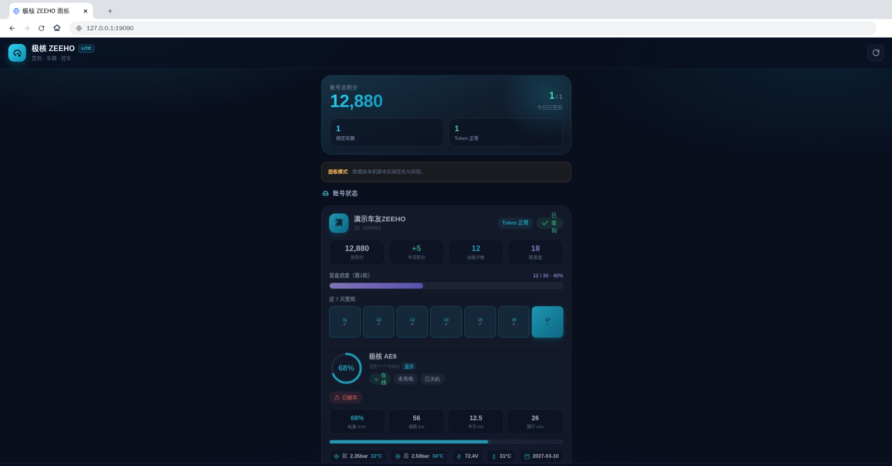
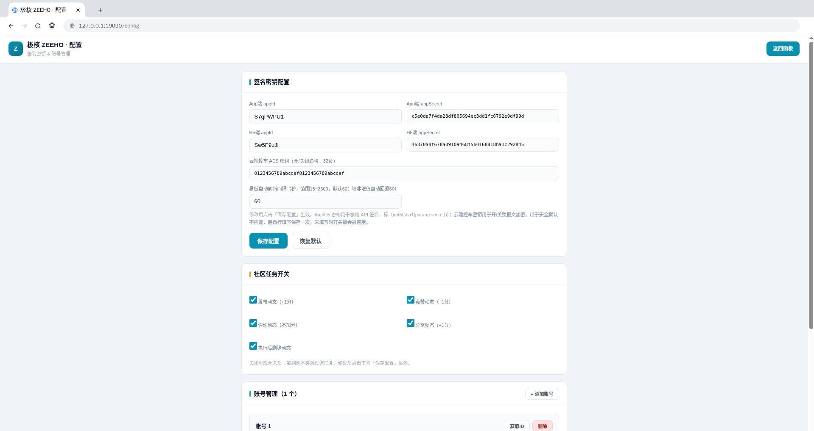

<div align="center">


# 极核 ZEEHO · 自动签到 & 增强面板·宁德福安鹤祥店

> 极核电动车 ZEEHO 的 **Loon / Quantumult X / Surge / Shadowrocket** 脚本
> 自动签到 · 社区积分任务 · 盲盒抽奖 · 车辆状态看板 · 远程控车
> HTML 可视化 BoxJS 面板，多账号管理，自动抓取 Token，无需手动复制请求头

[✨ 功能](#-主要功能) · [⚡ 一键导入](#-一键导入) · [📖 使用教程](#-使用教程) · [🖥️ 本地演示](#️-本地模拟演示无需代理工具) · [📁 目录结构](#-目录结构)

⚠️ **本仓库仅用于学习研究，禁止商用；使用产生的一切风险由使用者自行承担。**

</div>

---

## ✨ 主要功能

### 📅 签到 & 积分任务
- 每日自动签到，统计连续签到天数（跨月连签不重置）
- 社区互动任务：发帖、点赞、评论、分享，自动清理临时动态
- 连续签到满 **30 天自动开启盲盒抽奖**
- 面板展示**真实今日总积分（签到 + 互动 + 盲盒）**
- 多账号同时支持，账号异常**隔离运行**，单个失败不影响其他账号

### 🚗 车辆状态监控（读取）
- SOC 电量、续航、电压、充电电流、充电状态
- 前后胎压、胎温
- 今日骑行里程、骑行时长、最高速度
- 坐垫锁 / 整车锁 / 开关机 / 在线状态
- GPS 定位 + 地图跳转、服务到期时间

### 🎛️ 远程车辆控制（4G 下发指令）
> ⚠️ 会真实操作车辆，请在车辆附近谨慎操作，误触风险自负
1. 🔔 寻车（闪灯）
2. 📣 鸣笛寻车（鸣笛 + 闪灯）
3. 💺 弹开坐垫
4. 🔓 云端开锁（需配置 AES 密钥）
5. 🔒 云端关锁（需配置 AES 密钥）

每个操作带**二次确认弹窗**，实时返回执行结果。

---

## 🖼️ 界面预览





---

## ⚡ 一键导入

无需手动复制大段配置，按你的工具任选其一即可（**推荐 BoxJS 或 Surge 模块**）。


### 🎛️ BoxJS（跨工具统一管理，最推荐）
在 BoxJS 中添加订阅源，即可在**浏览器网页面板**里管理账号、配置、查看车辆数据与控车：

```
https://raw.githubusercontent.com/mlink798/ZEEHO/refs/heads/main/script/boxjs/zeeho.boxjs.json
```

- 面板访问地址：Loon / Surge 用 `http://zeeho.box`，Quantumult X 用 `http://www.example.com`
- 面板内即可抓 Token、签到、抽盲盒、看车辆数据、远程控车

### 🍎 Surge（模块一键导入）
把以下链接作为 **Surge 模块** 直接添加（Surge → 模块 → 安装新模块）：

```
https://raw.githubusercontent.com/mlink798/ZEEHO/refs/heads/main/modules/zeeho.sgmodule
```

### 🍏 Loon（插件一键导入）
把以下链接作为 **Loon 插件** 直接添加：

```
https://raw.githubusercontent.com/mlink798/ZEEHO/refs/heads/main/script/zeeho_box_enhanced.js
```

### 🍏 Quantumult X（订阅一键导入）
1. `[rewrite_remote]` 添加：
```
https://raw.githubusercontent.com/mlink798/ZEEHO/refs/heads/main/script/zeeho_qx.conf, tag=极核ZEEHO, enabled=true
```
2. `[task_local]` 添加签到任务（已在 conf 内提供，可手动复制）：
```
0 7 * * * https://raw.githubusercontent.com/mlink798/ZEEHO/refs/heads/main/script/zeeho.js, tag=极核每日签到, img-url=https://raw.githubusercontent.com/mlink798/ZEEHO/main/ZEEHO.png, enabled=true
```

> 💡 无论哪种方式，都需要**安装并信任 MITM 根证书**，否则抓不到极核 App 的加密接口（见下方教程）。

---

## 📖 使用教程

> 完整图文教程见 [`docs/部署教程.md`](docs/部署教程.md)。

### 第 1 步：安装并信任根证书
代理工具（Surge / Loon / QX）开启 MITM 后，安装并信任根证书；iOS 还需到
「设置 → 通用 → 关于本机 → 证书信任设置」开启**完全信任**。

### 第 2 步：一键导入（见上）并开启 MITM
- MITM 需覆盖：`tapi.zeehoev.com`、`h5.zeehoev.com`、`zeeho.box`（QX 用 `www.example.com`）
- 一键导入的模块 / 插件 / 订阅已自动写好 MITM hostname，无需手动添加

### 第 3 步：抓取 Token（自动）
1. 保持代理 + MITM 开启
2. 打开**极核 ZEEHO App** → 进入「我的」页面
3. 脚本自动捕获 Token 并保存到面板；也可在配置页手动粘贴（自动去除 `Bearer ` 前缀）

### 第 4 步：浏览器打开面板
| 工具 | 访问地址 |
|---|---|
| Surge / Loon | `http://zeeho.box` |
| Quantumult X | `http://www.example.com` |

面板内可：签到、抽盲盒、社区任务、车辆实时数据、远程控车、Bark 通知、多账号管理。

### 第 5 步（可选）：云端开 / 关锁密钥
配置页 → 签名密钥配置 → 填写云端控车 AES 密钥（32 位）→ 保存。未填写时开 / 关锁按钮自动禁用。

---

## 🖥️ 本地模拟演示（无需代理工具）

仓库附带 BoxJS 模拟运行环境（Node.js），零改动跑起脚本，浏览器直接看面板：

```bash
cd simulator
node boxjs_simulator.js              # 默认 8080 端口
PORT=19090 node boxjs_simulator.js   # 或指定端口
```

- 面板主页：`http://127.0.0.1:<端口>/`　配置页：`http://127.0.0.1:<端口>/config`
- 演示数据：`boxjs_store.example.json`（复制为 `boxjs_store.json` 即可；**真实部署请勿提交含真实 Token 的 store 文件**）

---

## 📁 目录结构

```
ZEEHO/
├── README.md                  # 项目说明（本文件）
├── LICENSE                    # 开源协议
├── ZEEHO.png                  # 图标
├── script/                    # 代理脚本（Loon/QX/Surge 使用）
│   ├── zeeho_box_enhanced.js  # 主增强脚本（面板 + 签到 + 车辆控制）
│   ├── zeeho.js               # 签到 / 抓 Token 脚本
│   ├── zeeho_qx.conf          # Quantumult X 一键订阅（新增）
│   └── boxjs/
│       └── zeeho.boxjs.json   # BoxJS 订阅源（新增）
├── modules/                   # 一键导入（新增）
│   ├── zeeho.sgmodule         # Surge 模块
│   └── zeeho.plugin           # Loon 插件
├── simulator/                 # 本地 BoxJS 模拟环境
│   ├── boxjs_simulator.js
│   └── boxjs_store.example.json
├── docs/                      # 文档
│   ├── 部署教程.md            # 真机部署 + 本地演示完整教程
│   └── images/
│       └── install-flow.svg   # 安装流程配图（新增）
└── screenshots/               # 演示截图
    ├── dashboard.png
    └── config.png
```

---

## ⚠️ 注意事项
- `boxjs_store.json`（本地运行生成）含账号 Token，**已被 `.gitignore` 忽略，禁止提交**
- 云端开 / 关锁 AES 密钥默认不内置，需在配置页手动填写，防止脚本被滥用
- 极核 App 更新导致接口加密变化时，脚本可能失效，等待适配
- 使用第三方脚本存在账号风控风险，请自行评估

---

## 🔗 相关链接
- 仓库主页：<https://github.com/mlink798/ZEEHO>
- 部署教程：[`docs/部署教程.md`](docs/部署教程.md)
